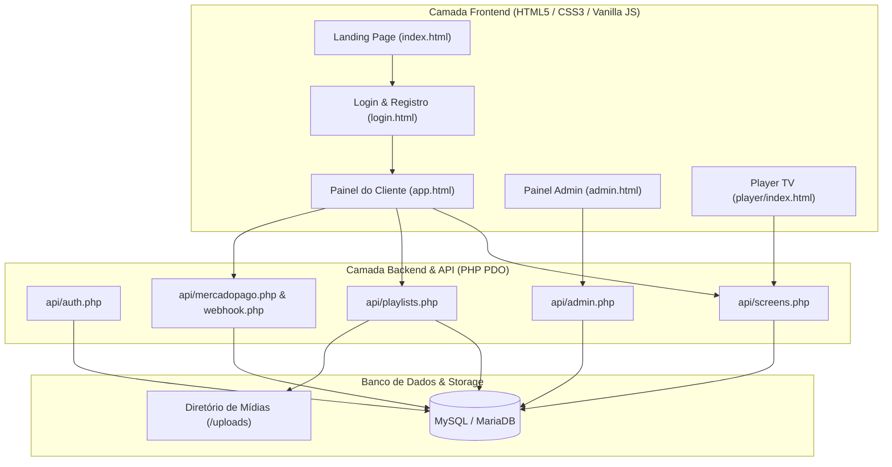
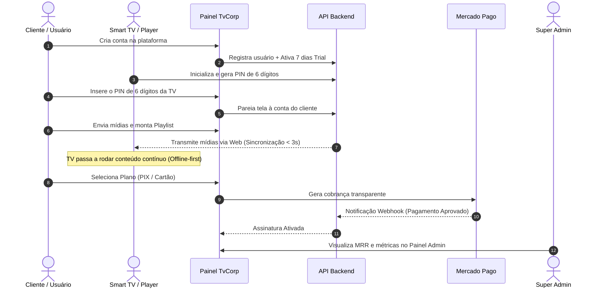

# 📑 Relatório de Status Executivo — TvCorp
**Plataforma SaaS de TV Corporativa & Digital Signage**

---

| Metadado | Informação |
| :--- | :--- |
| **Projeto** | TvCorp (Digital Signage & Mídia Indoor SaaS) |
| **Squad** | **A-Team** (PO: Mario Henrique / AI Agent: Antigravity) |
| **Data do Relatório** | 10 de Setembro de 2026 |
| **Status Geral** | 🟢 **100% Operacional (Pronto para Uso)** |
| **Fase do Ciclo de Vida** | **Fase 1 — Produção Operacional / Go-to-Market (v1.0)** |

---

## 🎯 1. Sumário Executivo

O **TvCorp** é uma plataforma SaaS completa voltada para a gestão centralizada de murais digitais, comunicação interna corporativa e mídia indoor em Smart TVs, TV Boxes e navegadores.

Após os ciclos de desenvolvimento, integração de pagamentos e unificação de banco de dados, o sistema atingiu o nível **100% Operacional**, estando apto para receber usuários reais, ativar períodos de degustação (*Trial 7 dias*) e processar assinaturas pagas via **Mercado Pago** (PIX Instantâneo e Cartão de Crédito).

---

## 🚦 2. Diagnóstico de Prontidão Operacional

| Módulo / Funcionalidade | Status | Condição de Uso |
| :--- | :---: | :--- |
| **Landing Page de Vendas & Simulador** | 🟢 Concluído | Design responsivo, tabela comparativa de planos e simulador animado de player ao vivo. |
| **Registro de Novos Clientes & Onboarding** | 🟢 Concluído | Criação de conta com ativação automática de **7 dias de Trial Grátis**. |
| **Player de TV (Digital Signage)** | 🟢 Concluído | Pareamento via código PIN de 6 dígitos, sincronização remota (<3s) e suporte *offline-first*. |
| **Painel do Cliente (Dashboard CMS)** | 🟢 Concluído | Gerenciamento de Telas, Upload de Mídias, Criação de Playlists e Gestão da Assinatura. |
| **Gateway de Pagamento (Mercado Pago)** | 🟢 Concluído | Checkout transparente via PIX (QR Code / Copia e Cola) e Cartão de Crédito (até 12x). |
| **Painel Super Admin** | 🟢 Concluído | Métricas SaaS (MRR, Clientes, Telas), controle de assinaturas e gestão de publicidades da Home. |
| **Pipelines de Deploy Automatizado** | 🟢 Concluído | Scripts PowerShell de deploy FTP para Homologação (`/hml`) e Produção (`/`). |

---

## 🏗️ 3. Arquitetura de Componentes

---

## 🔄 4. Fluxo Operacional de Ponta a Ponta

---

## 🌐 5. Ambientes, Links e Acesso

### Ambientes Online:
* **Produção (PROD):**
  * 🏠 **Site Oficial:** [https://tvcorp.hubdigital360.com/index.html](https://tvcorp.hubdigital360.com/index.html)
  * 📺 **Player de TV:** [https://tvcorp.hubdigital360.com/player/](https://tvcorp.hubdigital360.com/player/)
  * 💻 **Painel do Assinante:** [https://tvcorp.hubdigital360.com/app.html](https://tvcorp.hubdigital360.com/app.html)
  * 🛡️ **Painel Super Admin:** [https://tvcorp.hubdigital360.com/admin.html](https://tvcorp.hubdigital360.com/admin.html)

* **Homologação (HML):**
  * 🧪 **Site HML:** [https://tvcorp.hubdigital360.com/hml/index.html](https://tvcorp.hubdigital360.com/hml/index.html)
  * 📺 **Player HML:** [https://tvcorp.hubdigital360.com/hml/player/](https://tvcorp.hubdigital360.com/hml/player/)

### Credenciais Padrão do Super Admin:
* **E-mail:** `admin@tvcorp.com`
* **Usuário:** `mariozinhocs` (ou `admin`)
* **Senha:** `admin123`

---

## 🚀 6. Próximos Passos & Roadmap Estratégico

1. **Validação em Campo (Hardware):**
   * Realizar testes contínuos de 24h a 48h em TV Box Android e Smart TVs conectadas ao Wi-Fi.
2. **Lançamento & Aquisição:**
   * Divulgar a Landing Page para captação de clientes iniciais aproveitando o Trial Grátis de 7 dias.
3. **Expansão Futura (Versão 2.0):**
   * Empacotamento de APK dedicado para Android TV (Android Studio / PWA Wrapper).
   * Widgets adicionais (Cotação de Moedas, Notícias ao Vivo G1/UOL/CNN, Aniversariantes do Mês).

---

> **Aprovação do Squad A-Team:**  
> Documento oficial consolidado e pronto para arquivamento ou apresentação técnica/comercial.
